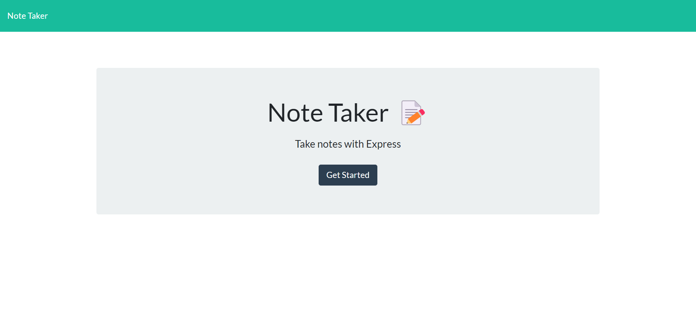
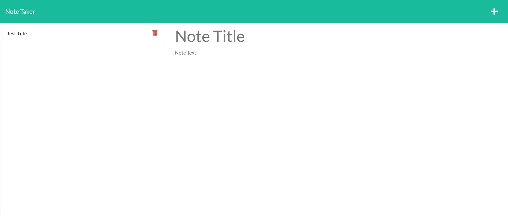
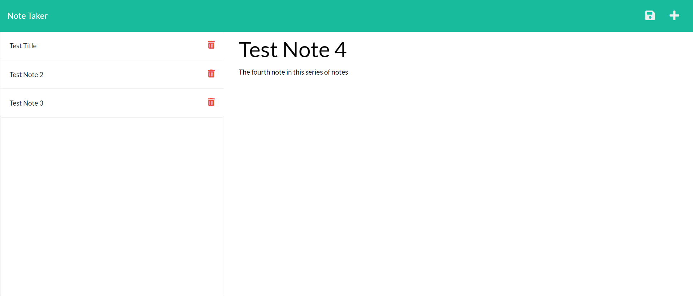

# Note Taker

Week 11 Challenge - Note App

## Description

This application creates and saves simple notes. The notes include a title, and text. Notes are saved to the server, and can be loaded, and also deleted. The application was built using JavaScript, Node.js, Express.js, HTML, and CSS. The front-end code was provided, and I built the back-end server.

## Table of Contents
* [Installation](#installation)
* [Usage](#usage)
* [Tests](#tests)
* [Questions](#questions)

---
## Installation

Run "npm start" to run local server, then visit: http://localhost:3001/

Alternatively, visit the deployed Heroku site at: https://infinite-earth-05342.herokuapp.com/

---
## Usage

On loading the site, the user is presented with a landing page, if they click the "Get Started" button, they will be taken to the notes page. On the notes page the user can look at previously saved notes by clicking the note in the left panel. If the user wants to add a note, they click the plus-sign in the top right of the page. Once text has been entered for the title and text fields of the new note, the note can be saved by clicking the save icon (disk) in the top right of the page. If the user wishes to delete any notes, then they can click the garbage can icon on the corresponding note in the left panel. 

---
## Tests

Below are images of the deployed site.

Landing Page

Notes Page

Notes page with test examples added

---
## Questions

[Note Taker on GitHub](https://github.com/philmcgarty/note-taker)

[Deployed site](https://infinite-earth-05342.herokuapp.com/)

[Note Taker on Heroku](https://dashboard.heroku.com/apps/infinite-earth-05342)

